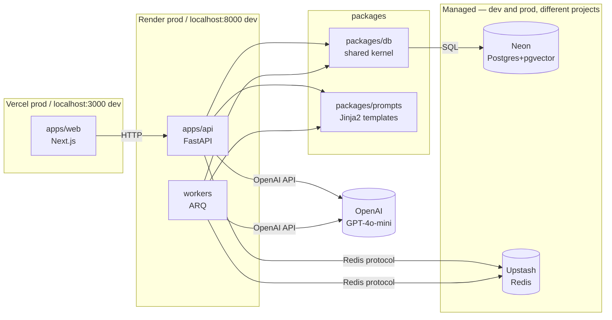

# RepoLens Architecture

## Overview

RepoLens helps engineers understand and plan changes in unfamiliar codebases. Four core features:
1. **Repository Import** - Clone and index any public GitHub repository
2. **AI Analysis** - Generate executive summaries, tech stack, and entry points
3. **Codebase Chat** - Ask questions grounded in actual repository code
4. **Implementation Planner** - Generate structured feature plans with checklists

This document tracks the high-level architecture. Detailed decisions live in `docs/adr/`.

## Topology



## Data Models

```
┌─────────────┐       ┌─────────────┐
│    User     │───────│   Project   │
└─────────────┘  1:N  └─────────────┘
                           │
                           │ 1:1
                           ▼
                    ┌─────────────┐
                    │ Repository  │
                    └─────────────┘
                           │
            ┌──────────────┼──────────────┐
            │              │              │
            ▼              ▼              ▼
     ┌────────────┐ ┌────────────┐ ┌────────────┐
     │ CodeChunk │ │KeyFile     │ │Analysis    │
     │(embedding)│ │            │ │            │
     └────────────┘ └────────────┘ └────────────┘

     ┌────────────┐       ┌────────────┐
     │ ChatSession│───────│ChatMessage │
     └────────────┘  1:N  └────────────┘

     ┌────────────┐       ┌────────────┐
     │PlanSession │───────│PlanVersion │
     └────────────┘  1:N  └────────────┘
```

## Key Architectural Decisions

| ADR | Decision |
|-----|----------|
| 0001 | Monorepo layout with peer API/Workers architecture |
| 0004 | Neon (Postgres+pgvector) + Upstash Redis for managed infra |
| 0017 | ARQ durable queue for background processing |
| 0020 | Semantic search via chunking, embeddings, and pgvector cosine distance |

## Request Lifecycles

### Repository Import Flow
```
1. User submits GitHub URL
2. API validates URL → enqueues clone job
3. Worker clones repo → extracts files → creates chunks
4. Worker generates embeddings → upserts to pgvector
5. Worker enqueues analysis job
6. Analysis LLM generates summary → stores in DB
7. Web polls for status updates
```

### Chat Flow
```
1. User sends message
2. API retrieves relevant chunks (embedding similarity)
3. Chunks + history → OpenAI streaming API
4. SSE response → frontend displays incrementally
5. Final message persisted to DB
```

## Testing Strategy

| Layer | Tool | Location |
|-------|------|----------|
| Unit Tests | pytest + pytest-mock | `apps/api/tests/` |
| Integration | Testcontainers (Postgres+Redis) | `apps/api/tests/` |
| API Validation | httpx + ASGITransport | `apps/api/tests/` |
| Frontend Unit | Vitest + React Testing Library | `apps/web/tests/` |
| E2E | Playwright | `apps/web/tests/e2e/` |

## Security

- **CORS**: Restricted to configured frontend URL
- **Authentication**: Clerk JWT validation on all API routes
- **Authorization**: Project ownership checks on all data operations
- **Input Validation**: Pydantic schemas for all API inputs
- **Prompt Injection**: Grounding context prevents hallucinated file references
- **XSS**: Markdown rendering sanitizes code blocks

## Milestone Status

All milestones M0–M8 are complete. See `README.md` for full feature list.
