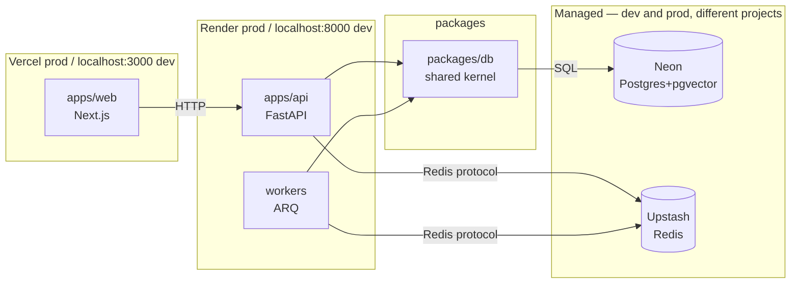

# RepoLens Architecture

## Overview

RepoLens helps engineers understand and plan changes in unfamiliar codebases. Four features: repository import, AI-generated repo understanding, repo chat, implementation planning (plans only, never generated code).

This document tracks the high-level architecture. Detailed decisions live in `docs/adr/`.

## Topology

## Dev/prod parity

The same code talks to the same *kind* of managed service in dev and prod; only credentials/project differ. Infra-axis parity is strong — Neon manages pgvector identically in both environments. Remaining parity debt is on the app-runtime axis (native dev vs containerized prod on Vercel/Render), explicitly closed in Milestone 8. See ADR 0001.

## Components

| Component | Location | Role |
|-----------|----------|------|
| Web | `apps/web` | Next.js frontend, deployed to Vercel |
| API | `apps/api` | FastAPI backend, deployed to Render |
| Workers | `workers/` | ARQ background jobs (repo clone, embedding, summary), deployed to Render |
| DB kernel | `packages/db` | SQLAlchemy models + session/engine; shared peer dependency of API and Workers |
| Postgres | Neon | Primary store + pgvector embeddings |
| Redis | Upstash | ARQ job queue transport |

`apps/api` and `workers/` are **peers**: both depend on `packages/db`, neither depends on the other. See ADR 0001.

## Milestone progress

- **M0 — Foundation** (done): monorepo skeleton, workspace manifests, secrets contract, architecture docs and ADRs.
- **M1 — Authentication** (done): Clerk auth, User/Project models, FastAPI backend, Next.js frontend, TanStack Query, CI build-smoke, Makefile targets.
- **M2 — Repository upload** (current): Repository model, shallow clone service, metadata extraction, GitHub repo picker, admin dashboard, GitHub-only auth.
- M3–M8 — see `README.md`.
